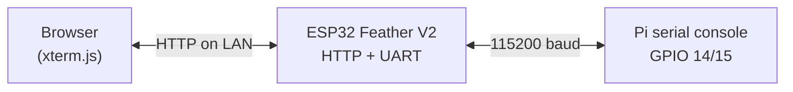

# esp_remote

Use an [Adafruit ESP32 Feather V2 w.FL (#5438)](https://www.adafruit.com/product/5438) to reach a **Raspberry Pi serial console in your browser** when the Pi is not on the network. The ESP32 joins WiFi; you open its web UI. The Pi only needs UART wired to the Feather — **nothing runs on the Pi**.

## How it works



1. **ESP32** connects to WiFi and serves a login page + terminal at `http://<esp32-ip>:8080/` (port `WEB_PORT`, default 8080 — port 80 is reserved for Web Workflow).
2. **Browser** polls `/api/output` and posts keystrokes to `/api/input`; the ESP32 forwards bytes to/from the Pi on `TX`/`RX`. Use **Log out** in the terminal header to end the web session and send `exit` to the Pi shell.
3. **Raspberry Pi** stays offline-friendly — no agent, no `poetry run serve`, no TCP bridge to the Pi.

Security: set `WEB_PASSWORD` in `settings.toml`. Optional `WEB_SESSION_TTL_S` (default in example: 1800) logs you out after that many seconds **without** terminal activity (idle timeout); the browser is sent to login on HTTP 401. Set `WEB_SESSION_TTL_S = 0` for no ESP32-side expiry (previous behavior). Traffic is HTTP on your LAN (TLS on ESP32 is not practical in CircuitPython); use a trusted network.

## Wiring (ESP32 ↔ Pi console UART)

| ESP32 Feather V2 | Raspberry Pi (header) |
|------------------|-------------------------|
| `TX`  (yellow)   | Pin 10 — `RXD` / GPIO 15 |
| `RX`  (orange)   | Pin  8 — `TXD` / GPIO 14 |
| `GND` (black)    | Pin  6 — `GND` |

On the Pi, enable the serial console (`enable_uart=1` in `/boot/firmware/config.txt`). Cross TX/RX — do not tie TX to TX.

## Setup

### 1. Flash CircuitPython

Factory reset or first install — see [CircuitPython for ESP32 Feather V2](https://circuitpython.org/board/adafruit_feather_esp32_v2/).

### 2. Configure and deploy

On your **development machine** (not the Pi):

```bash
poetry install
cp settings.toml.example settings.toml
# CIRCUITPY_WIFI_*, WEB_PASSWORD

poetry run circup-install --serial   # adafruit_httpserver → /lib
poetry run deploy --serial --settings
```

Watch the serial REPL for `esp_remote: open http://<ip>:8080/` and browse there.

WiFi deploy uses **CircuitPython Web Workflow on port 80** (not `WEB_PORT` 8080):

```bash
poetry run deploy --settings   # ESP32_IP + CIRCUITPY_WEB_API_PASSWORD
```

If WiFi deploy times out but `ping` works, the board is up but Web Workflow is not
responding (often because `code.py` crashed). Recover over USB:

```bash
poetry run deploy --serial --settings
```

## Verify the terminal

After deploy, from your dev machine (same LAN as the ESP32):

```bash
poetry run verify-terminal
```

This logs in, reads `/api/status` and `/api/output`, sends Enter to the Pi serial port,
and reports whether bytes came back. In the browser, the status line shows
`rx N B, tx M B` — if **rx** stays at the banner size only, the HTTP bridge works but
the Pi UART path needs wiring or `enable_uart=1` on the Pi.

You should see a startup line like `[esp_remote] bridge ready` in the terminal as soon
as you open it (proves login + polling work without the Pi).

## Development

```bash
poetry run lint      # Python + static HTML path checks (+ djlint on static/*.html)
poetry run test      # includes firmware compat + static web validation
poetry run verify-terminal
poetry run circup-install --check
poetry run deploy --serial --settings
```

### Project layout

```
code.py / boot.py
static/              # login + terminal UI → CIRCUITPY/static/
src/esp_remote/firmware/
  main.py            # WiFi + HTTP server + UART loop
  web_terminal.py
  uart_pi.py
  uart_buffer.py
```

Device libraries are declared in `[tool.esp_remote.circuitpython]` in `pyproject.toml`.

## About

ESP32-hosted web serial console for a headless Pi when the Pi has no network path.
